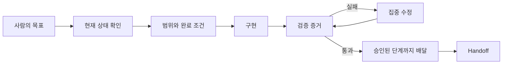

# 나는 Claude Code와 LLM 에이전트를 이렇게 쓴다

> “코드를 대신 써주는 챗봇”에서 “검증 가능한 개발 동료”로 넘어가는 실전 안내서

이 저장소는 회사에 Claude Code가 도입됐지만 아직 익숙하지 않은 개발자와 기술 리더에게, 내가 실제 프로젝트에서 LLM 에이전트를 사용하는 방식을 소개한다.

목표는 명령어를 많이 외우거나 복잡한 멀티 에이전트 시스템을 만드는 것이 아니다. 다음 네 가지 습관을 익히는 것이다.

1. 에이전트가 작업하기 전에 **현재 상태와 요구사항의 권위**를 확인한다.
2. 무엇을 바꿀지뿐 아니라 **바꾸지 않을 범위와 완료 조건**도 준다.
3. “완료했습니다”라는 답변 대신 **diff, test, review, 실제 동작**으로 확인한다.
4. 중요한 작업은 **구현자와 검증자**를 분리하고 다음 세션이 이어받을 기록을 남긴다.

## 누구를 위한 문서인가

### Claude Code를 처음 쓰는 개발자

먼저 [15분 Quickstart](docs/00-start-here/quickstart.md)를 따른다. 자신의 저장소에 최소 규칙 파일을 추가하고, 읽기 전용 탐색 → 작은 수정 → 검증까지 한 번 경험한다.

### 몇 번 사용했지만 결과가 들쭉날쭉한 개발자

[기본 정신모델](docs/00-start-here/mental-model.md)과 [운영 파일](docs/10-foundations/instruction-files.md)을 읽는다. 긴 프롬프트보다 저장소에 지속되는 작업 계약을 만든다.

### 팀 도입과 품질 기준을 설계하는 리더

[팀 도입 가이드](docs/00-start-here/team-adoption.md), [하네스 패턴](docs/20-workflows/harness-patterns.md), [평가 계약](docs/90-evaluation/evaluation-rubric.md)을 읽는다. 모든 작업을 자동화하지 말고 위험도에 맞는 gate를 정한다.

## 2분 요약



일상 작업의 기본값은 단일 에이전트다.

```text
현재 상태 확인 → 좁은 작업 계약 → 구현 → 관련 테스트 → diff 확인 → 보고
```

변경 위험이 커질 때만 단계를 추가한다.

```text
작은 수정
  → 계획–실행–검증
    → 구현자–독립 리뷰어
      → 서로 독립적인 여러 worktree lane
        → 증거 기반 자동화
```

복잡한 하네스를 먼저 만들지 않는다. 각 단계는 실제로 겪은 실패를 막을 때만 추가한다.

## 내가 Claude Code를 시작하는 방식

### 1. 바로 수정시키지 않고 먼저 읽게 한다

```text
이 저장소의 AGENTS.md/CLAUDE.md와 관련 문서를 읽고,
현재 branch, git status, 테스트 방법을 확인해.
아직 파일은 수정하지 말고 이 작업에 영향을 주는 범위와 위험만 요약해.
```

### 2. 목표를 관찰 가능한 결과로 바꾼다

나쁜 요청:

```text
로그인 고쳐줘.
```

더 나은 요청:

```text
만료된 세션으로 보호 페이지에 접근하면 로그인 화면으로 이동하고,
로그인 후 원래 페이지로 돌아와야 해.
인증 모듈과 관련 테스트만 수정하고 다른 라우팅은 정리하지 마.
수정 전 실패를 재현하고, 완료 후 실행한 검증과 남은 한계를 알려줘.
```

### 3. 변경과 외부 효과를 구분한다

- 파일 읽기와 상태 확인: 일반적으로 안전한 탐색
- 로컬 파일 수정: 요청한 구현 범위 안에서 수행
- local commit: 명시적 요청 또는 팀의 승인된 자동화 계약이 있을 때
- push, PR, merge, 배포, Issue 종료: 각각 승인된 범위 안에서 수행

### 4. 결과보다 증거를 확인한다

| 증거 | 주로 확인하는 것 | 이것만으로 모르는 것 |
|---|---|---|
| diff | 실제 변경 내용과 범위 | 런타임 동작 |
| test | 작성된 사례에서의 동작 | 요구사항 전체와 사용자 가치 |
| 독립 review | spec·diff의 누락과 위험 | 결함의 완전한 부재 |
| CI | 깨끗한 자동 환경의 gate | 실제 운영 배포 |
| black-box 검증 | 공개 인터페이스의 사용자 outcome | 모든 내부 불변 조건 |

## 초급 → 중급 → 고급

### 초급: 안전하게 한 작업을 끝낸다

- 저장소를 설명하게 한다.
- 작은 범위 하나만 수정시킨다.
- 관련 test와 diff를 직접 확인한다.
- commit이나 push는 별도로 요청한다.

다음 단계로 올라가는 기준: 반복 작업에서 매번 같은 규칙과 명령을 다시 설명하고 있다.

### 중급: 프로젝트가 작업 방식을 기억하게 한다

- `AGENTS.md`에 공통 작업 규칙을 둔다.
- `CLAUDE.md`는 Claude Code용 얇은 진입점으로 둔다.
- `CONTEXT.md`에 제품 목적과 도메인 언어를 둔다.
- Issue에 범위와 acceptance criteria를 둔다.
- `HANDOFF.md`로 다음 세션의 재개 지점을 남긴다.

다음 단계로 올라가는 기준: 변경 위험이 커서 구현자의 자기검증만으로 부족하거나, 서로 독립적인 작업이 실제로 여러 개 있다.

### 고급: 역할과 검증을 분리한다

- 구현자와 read-only 리뷰어를 분리한다.
- Issue의 의존성과 write conflict를 DAG로 만든다.
- 독립적인 lane만 별도 worktree에서 병렬 실행한다.
- 결과를 artifact와 receipt로 남겨 자동 검증한다.
- 모델은 작업 역할과 실패 비용에 따라 선택한다.

다시 단순하게 내려가는 기준: 역할 분리와 상태 관리 비용이 작업 실패 비용보다 크다.

## 오케스트레이터는 사람의 운영 노동을 대신한다

내가 지향하는 고급 workflow에서 사람은 매 단계마다 agent를 고르고, prompt를 전달하고, 끝났는지 확인하고, 다음 agent를 호출하는 project manager 역할을 하지 않는다.

```text
사람: 목표와 material decision
  ↓
오케스트레이터:
  요청 해석 → context 조립 → workflow/skill 선택 → task graph
  → dispatch → artifact 수집 → 독립 검증 → repair/replan → receipt
```

오케스트레이터가 대신하는 것은 반복적인 routing과 상태 관리다. 사람에게 남기는 것은 제품 목적·범위·사용자 계약을 바꾸거나 되돌리기 어려운 외부 효과를 승인하는 결정이다. 모델의 confidence가 낮다는 이유만으로 모든 선택을 사람에게 돌려보내지 않는다.

이 운영 모델과 단계별 도입 방법은 [오케스트레이터가 operator가 되는 방식](docs/20-workflows/orchestrator-as-operator.md)에 정리했다.

## 프로젝트에 두는 문서

```text
project/
├── AGENTS.md              모든 에이전트의 작업 규칙
├── CLAUDE.md              Claude Code용 얇은 어댑터
├── CONTEXT.md             제품 목적과 도메인 언어
├── HANDOFF.md             현재 작업 snapshot, 필요할 때만
├── MEMORY.md              검증된 장기 교훈, 필요할 때만
└── docs/
    ├── README.md          문서 지도와 권위
    ├── product/           사용자, 문제, 범위, 비목표
    ├── architecture/      시스템 경계와 런타임 계약
    ├── adr/               되돌리기 어려운 결정
    ├── plans/             구현 순서와 임시 계획
    ├── research/          조사 근거와 불확실성
    ├── reviews/           독립 검토 결과
    ├── operations/        실행·배포·복구 절차
    └── archive/           더 이상 권위가 아닌 역사 자료
```

모든 프로젝트가 이 구조 전체를 필요로 하지는 않는다. 파일과 폴더는 실제 내용이 생길 때 만든다. 자세한 목적, 수명, 승격·보관 규칙은 [docs 구조 예시](docs/10-foundations/docs-structure.md)와 [복사 가능한 skeleton](examples/project-operating-system/docs/README.md)에 있다.

## 자주 사용하는 워크플로우

- [저장소 재개](docs/20-workflows/workflow-patterns.md#1-저장소-재개)
- [기능 구현](docs/20-workflows/workflow-patterns.md#2-기능-구현)
- [버그 진단과 수정](docs/20-workflows/workflow-patterns.md#3-버그-진단과-수정)
- [설계 결정](docs/20-workflows/workflow-patterns.md#4-설계-결정)
- [독립 리뷰와 focused repair](docs/20-workflows/workflow-patterns.md#5-독립-리뷰와-focused-repair)
- [여러 Issue의 DAG 처리](docs/20-workflows/workflow-patterns.md#6-열린-issue-dag-처리)
- [UI 블랙박스 검증](docs/20-workflows/workflow-patterns.md#7-ui-블랙박스-검증)
- [GitHub 배달과 종료](docs/20-workflows/workflow-patterns.md#8-github-배달과-종료)
- [세션 종료와 memory 승격](docs/20-workflows/workflow-patterns.md#9-세션-종료와-기억-승격)
- [오케스트레이터 중심 실행](docs/20-workflows/orchestrator-as-operator.md)

실제 세션 전체를 다시 탐색해 발견한 세션 위생, phase 운영, plugin 진단, 모델 라우팅 같은 추가 습관은 [세션에서 발견한 공통 패턴](docs/20-workflows/session-derived-patterns.md)에 정리했다.

## 도구는 이렇게 조합한다

- Claude Code: 일상 탐색, 구현, 테스트, Git 작업
- Codex: 구현, 분석, 독립 리뷰, 병렬 agent 작업
- Superpowers: brainstorming, planning, TDD, debugging, subagent workflow
- GSD: milestone과 phase가 있는 장기 프로젝트
- Orca: 여러 agent와 worktree를 나란히 운영
- Matt Pocock Skills: domain modeling, codebase design, grilling, review
- context-mode: 긴 로그와 대규모 탐색의 컨텍스트 절약
- Playwright/browser: 실제 UI와 사용자 여정 검증

도구별 역할과 선택 기준은 [toolbox](docs/30-tooling/toolbox.md)에 있다. 핵심 workflow는 특정 모델이나 plugin이 없어도 파일, Git, test, review 계약으로 유지된다.

## 저장소 학습 경로

### 첫날

1. [15분 Quickstart](docs/00-start-here/quickstart.md)
2. [기본 정신모델](docs/00-start-here/mental-model.md)
3. [복사 가능한 AGENTS.md](examples/project-operating-system/AGENTS.md)

### 첫 주

1. [운영 파일의 역할](docs/10-foundations/instruction-files.md)
2. [docs 구조](docs/10-foundations/docs-structure.md)
3. [워크플로우 패턴](docs/20-workflows/workflow-patterns.md)
4. [End-to-end 예시](docs/20-workflows/example-end-to-end.md)

### 팀 표준화

1. [팀 도입 가이드](docs/00-start-here/team-adoption.md)
2. [하네스 선택](docs/20-workflows/harness-patterns.md)
3. [작업 계약 템플릿](templates/agent-contracts.md)
4. [평가 방식과 완료 조건](docs/90-evaluation/evaluation-rubric.md)

## 저장소 지도

| 위치 | 목적 |
|---|---|
| [`docs/00-start-here`](docs/00-start-here/README.md) | Claude Code에 익숙하지 않은 독자의 시작점 |
| [`docs/10-foundations`](docs/10-foundations/README.md) | 운영 파일, 문서 구조, 핵심 개념 |
| [`docs/20-workflows`](docs/20-workflows/README.md) | 반복 workflow, harness, 실제 사례 |
| [`docs/30-tooling`](docs/30-tooling/README.md) | Claude Code와 외부 skill/plugin |
| [`docs/90-evaluation`](docs/90-evaluation/README.md) | 품질 기준, 독립 리뷰, 평가 결과 |
| [`examples`](examples/project-operating-system/AGENTS.md) | 복사 가능한 프로젝트 운영 skeleton |
| [`templates`](templates/README.md) | 구현, 리뷰, handoff, DAG, orchestrator 작업 계약 |

## 이 자료의 완료 기준

이 저장소 자체도 느낌으로 완료하지 않는다. [평가 계약](docs/90-evaluation/evaluation-rubric.md)에 따라 자동 검사, 초보 독자 과제, 두 축의 독립 리뷰를 통과해야 한다. 목표는 85/100 이상, 모든 영역 3.5/5 이상, High·Medium finding 0개다.

## 라이선스

[MIT](LICENSE)
