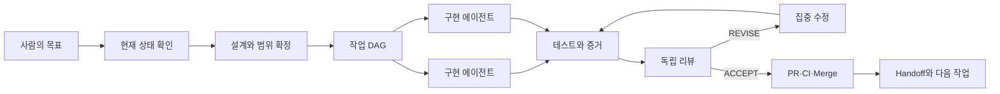
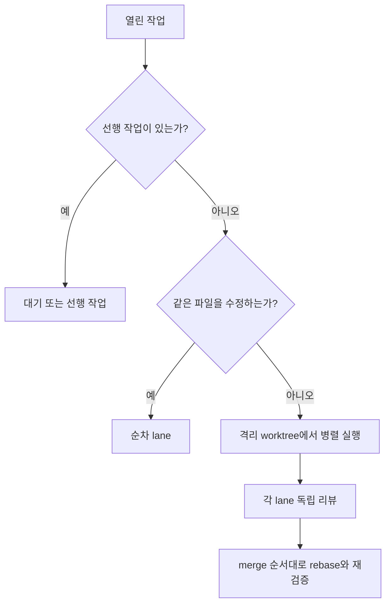

# 나는 LLM 에이전트를 이렇게 쓴다

> 코드를 대신 써주는 챗봇에서, 검증 가능한 작은 개발 조직으로.

이 문서는 내가 Codex와 Claude 같은 LLM 에이전트를 실제 소프트웨어 작업에 사용하는 방식을 설명하는 초안이다. 핵심은 더 화려한 프롬프트가 아니다. **작업의 권위, 범위, 역할, 검증, 완료 조건을 구조화하는 것**이다.

## 문서 지도

- [공통 운영 파일](docs/instruction-files.md): `AGENTS.md`, `CLAUDE.md`, `CONTEXT.md`, memory, handoff
- [워크플로우 패턴](docs/workflow-patterns.md): 자주 반복하는 실제 작업 순서
- [하네스 패턴](docs/harness-patterns.md): 작업 위험도에 따른 실행 구조
- [스킬과 플러그인](docs/toolbox.md): 자주 쓰는 오픈소스 도구와 선택 기준
- [핵심 개념](docs/concepts.md): authority, artifact, gate, lane, receipt 등
- [복사 가능한 운영 파일](examples/project-operating-system/AGENTS.md)
- [작업 계약 템플릿](templates/agent-contracts.md)
- [리뷰 기준](docs/review-criteria.md)

## 한눈에 보기



내가 사용하는 기본 루프는 다음과 같다.

1. 저장소와 실행 환경의 현재 상태를 먼저 확인한다.
2. 제품 설계, 구현 계획, 현재 이슈를 구분한다.
3. 작업을 의존성과 충돌 가능성에 따라 나눈다.
4. 구현자에게 좁은 범위와 완료 조건을 준다.
5. 테스트 결과와 변경 diff를 증거로 남긴다.
6. 중요한 변경은 별도의 리뷰어가 검토한다.
7. 통과한 결과만 PR, CI, merge 단계로 보낸다.
8. 다음 세션이 이어받을 수 있도록 상태를 기록한다.

## 숙련도별 사용 방식

### 1. 초보자: AI를 실행 가능한 페어 프로그래머로 사용한다

처음에는 대화보다 **프로젝트 안에서 실제 행동하게 만드는 것**이 중요하다.

- 관련 코드를 읽고 기능 구현하기
- 오류 재현 후 원인 찾기
- 테스트, 빌드, 린트 실행하기
- 로컬 서버를 띄우고 동작 확인하기
- 수정한 파일과 남은 문제 보고하기

좋은 요청의 기본형:

```text
현재 상태와 관련 파일을 먼저 확인해줘.
기존 사용자 변경은 보존하고, 이 기능에 필요한 범위만 수정해.
수정 후 가장 관련 있는 테스트를 실행하고 결과와 남은 한계를 알려줘.
```

이 단계의 완료 기준은 “AI가 됐다고 말함”이 아니라 **변경된 코드와 실행된 검증**이다.

### 2. 중급자: 한 번의 작업을 닫힌 루프로 운영한다

중급 단계에서는 구현만 맡기지 않는다.

```text
상태 확인 → 계획 → 구현 → 테스트 → diff 검토
→ 문서 갱신 → PR → handoff
```

다음 파일들이 세션 사이의 공통 언어가 된다.

- `AGENTS.md`: 저장소 안에서 지켜야 할 작업 규칙
- `CONTEXT.md`: 제품과 도메인의 현재 맥락
- ADR 또는 설계 문서: 중요한 결정과 불변 조건
- GitHub Issue: 작업 범위와 acceptance criteria
- `HANDOFF.md`: 현재 상태, 증거, 다음 작업

핵심은 한 세션의 긴 대화에 의존하지 않는 것이다. 새 에이전트도 파일과 Git 상태를 읽으면 같은 기준에서 일을 이어갈 수 있어야 한다.

### 3. 고급자: 여러 에이전트를 검증 가능한 조직으로 운영한다

고급 단계에서는 역할을 분리한다.

| 역할 | 책임 | 하지 않는 일 |
|---|---|---|
| 코디네이터 | 상태 확인, 작업 분해, 의존성 관리 | 모든 코드를 직접 작성 |
| 구현자 | 지정된 범위 구현과 집중 테스트 | 자신의 결과를 최종 승인 |
| 리뷰어 | 요구사항과 diff를 독립 검토 | 무관한 리팩터링 제안 |
| 제품 비평가 | 사용자 가치와 범위 검증 | 구현 세부사항 반복 |
| 블랙박스 사용자 | 실제 UI에서 결과 확인 | 내부 API를 정답 경로로 사용 |

병렬화도 무조건 많이 실행하는 것이 아니다.



## 내가 중요하게 보는 원칙

### 현재 상태가 과거 기록보다 우선한다

Handoff와 메모리는 출발점이지 현재 사실의 증명이 아니다. 작업을 재개할 때는 branch, HEAD, diff, 테스트, PR, CI, 이슈 상태를 다시 확인한다.

### 제품 설계와 구현 순서를 분리한다

- 제품 설계: 무엇을 왜 만들며 어떤 행동을 보장하는가
- 아키텍처와 프로토콜: 구성 요소와 런타임 계약은 무엇인가
- 구현 계획: 어떤 순서로 만들 것인가
- 이슈: 지금 배달할 최소 단위는 무엇인가

로드맵의 순서가 제품의 영구적인 진실로 둔갑하지 않게 한다.

### 구현자와 검증자를 분리한다

테스트가 통과해도 요구사항 누락, 잘못된 범위, 공개 증거 부족, 동시성 문제는 남을 수 있다. 중요한 변경은 독립 리뷰어가 이슈 목적과 실제 diff를 기준으로 판정한다.

### 실패하면 전체를 다시 만들지 않는다

리뷰 결과는 가능한 한 구체적인 finding으로 만든다. 구현자는 그 finding만 집중 수정하고 관련 검증을 다시 실행한다.

### 완료 상태를 세분화한다

다음은 서로 다른 상태다.

- 구현 완료
- 로컬 테스트 통과
- 독립 리뷰 통과
- CI 통과
- PR merge 완료
- 이슈 종료
- 실제 사용자 대상 반영 완료

## 실전 예시

### 좁은 구현 요청

```text
Issue의 목적과 acceptance criteria를 먼저 확인해.
허용된 파일 범위 안에서만 구현하고 관련 없는 정리는 하지 마.
가장 좁은 실패 테스트부터 추가한 뒤 구현해.
완료 시 변경 파일, 테스트 결과, 남은 제한을 보고해.
```

### 독립 리뷰 요청

```text
저장소를 수정하지 마.
이슈의 목적과 지정된 diff만 검토해.
구체적인 실패, 회귀, 범위 확장만 심각도순으로 보고해.
문제가 없으면 ACCEPT, 수정이 필요하면 REVISE 또는 REJECT로 결론 내.
```

### 세션 재개 요청

```text
HANDOFF를 읽고 현재 Git, 테스트, PR, 이슈 상태를 다시 확인해.
완료된 작업을 재실행하지 말고, 남은 작업의 실제 의존성 DAG를 만들어.
지금 병렬 실행 가능한 lane과 사용자 결정이 필요한 항목을 분리해.
```

더 구체적인 복사·수정용 양식은 [templates/agent-contracts.md](templates/agent-contracts.md)에 정리했다.

## 바로 가져다 쓸 수 있는 운영 파일

도구마다 같은 규칙을 중복 작성하지 않고 역할을 나눈다.

| 파일 | 담는 내용 | 담지 않는 내용 |
|---|---|---|
| `AGENTS.md` | 모든 에이전트가 지킬 작업 규칙 | 프로젝트 역사와 세션 로그 |
| `CLAUDE.md` | Claude 전용 진입점과 도구 차이 | `AGENTS.md` 규칙의 복사본 |
| `CONTEXT.md` | 제품 목적, 도메인, 설계 권위 | 현재 branch나 일회성 작업 상태 |
| `MEMORY.md` | 반복 사용 가치가 있는 검증된 교훈 | 비밀값, 원문 대화, 변하기 쉬운 상태 |
| `HANDOFF.md` | 지금 진행 중인 작업과 재개 지점 | 영구적인 제품 설계 |

설계 원칙과 로딩 순서는 [docs/instruction-files.md](docs/instruction-files.md)에, 복사 가능한 최소 예시는 [examples/project-operating-system](examples/project-operating-system)에 있다.

## 하네스 선택

모든 작업에 다중 에이전트가 필요한 것은 아니다. 변경 위험과 병렬성에 따라 가장 작은 하네스를 선택한다.

| 상황 | 권장 하네스 |
|---|---|
| 질문, 작은 문서 수정 | 단일 에이전트 |
| 명확한 작은 기능 | 계획–실행–검증 |
| 중요한 코드 변경 | 구현자–독립 리뷰어 |
| 서로 충돌하지 않는 여러 이슈 | worktree DAG |
| 제품 UI와 사용자 여정 | 블랙박스 하네스 |
| 중요한 설계 결정 | 다중 관점 의사결정 |
| 반복 배달과 운영 자동화 | 증거 기반 CI 하네스 |

각 형태의 구조, 장단점, 종료 조건은 [docs/harness-patterns.md](docs/harness-patterns.md)에 정리했다.

## 최종 요약

나는 LLM을 “정답을 말하는 존재”로 사용하지 않는다. 대신 다음 조건을 갖춘 작업자로 사용한다.

- 무엇이 권위 있는 요구사항인지 안다.
- 자신의 작업 범위와 금지 사항을 안다.
- 결과를 파일, diff, 테스트로 남긴다.
- 다른 에이전트의 검증을 받을 수 있다.
- 실패를 구체적인 수정 작업으로 바꾼다.
- 다음 세션이 현재 상태에서 이어받을 수 있다.

좋은 에이전트 워크플로우는 모델 하나가 똑똑해지는 것이 아니라, **모델이 바뀌어도 결과의 신뢰성을 유지하는 시스템**이다.

## 문서 상태

초안이다. 실제 사례, 스크린샷, 도구별 설정 예시는 개인 정보와 프로젝트 정보를 제거한 뒤 추가할 예정이다.
