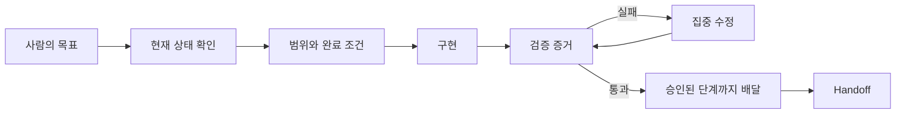

# 나는 Claude Code와 LLM 에이전트를 이렇게 쓴다

> “코드를 대신 써주는 챗봇”에서 “검증 가능한 개발 동료”로 넘어가는 실전 안내서

이 저장소는 회사에 Claude Code가 도입됐지만 아직 익숙하지 않은 개발자와 기술 리더에게, 내가 실제 프로젝트에서 LLM 에이전트를 사용하는 방식을 소개한다.

목표는 명령어를 많이 외우거나 복잡한 멀티 에이전트 시스템을 만드는 것이 아니다.

1. 작업 전에 **현재 상태와 요구사항의 권위**를 확인한다.
2. **변경 범위·금지 사항·완료 조건**을 함께 준다.
3. “완료했습니다” 대신 **diff·test·review·실제 동작**으로 확인한다.
4. 중요한 작업은 **구현자와 검증자**를 분리하고 재개 가능한 기록을 남긴다.

## 어디서 시작할까

처음이고 무엇을 고를지 모르겠다면 [기본 정신모델](docs/00-start-here/mental-model.md)로 이 방식부터 이해한다. 직접 해보고 싶을 때만 [15분 Quickstart](docs/00-start-here/quickstart.md)로 넘어가고, 나머지는 실제 문제가 생겼을 때 찾아본다.

| 나의 상황 | 권장 시작점 | 얻는 결과 |
|---|---|---|
| Claude Code가 처음이다 | [기본 정신모델](docs/00-start-here/mental-model.md) | 먼저 이 방식의 이유와 안전 경계 이해 |
| 설명을 이해했고 직접 해보고 싶다 | [15분 Quickstart](docs/00-start-here/quickstart.md) | 읽기 → 작은 수정 → 검증의 첫 성공 |
| 몇 번 썼지만 결과가 들쭉날쭉하다 | [기본 정신모델](docs/00-start-here/mental-model.md) | 긴 prompt 대신 지속되는 작업 계약 |
| 팀 규칙을 만들고 있다 | [팀 도입 가이드](docs/00-start-here/team-adoption.md) | 회사 정책과 개인 workflow의 분리 |
| 여러 agent를 운영하고 싶다 | [하네스 패턴](docs/20-workflows/harness-patterns.md) | 위험도에 맞는 역할과 gate 선택 |
| 흩어진 요구사항을 실행 prompt로 정리하고 싶다 | [메타프롬프팅](docs/20-workflows/meta-prompting.md) | 승인된 범위와 완료 조건이 있는 Fresh Run prompt |
| 제품 설계 문서를 어떻게 나눌지 고민이다 | [제품 설계 문서 분할](docs/10-foundations/product-design-docs.md) | 규모에 맞는 구조와 권위 충돌 방지 규칙 |
| 낯선 용어가 많다 | [쉬운 용어집](docs/00-start-here/glossary.md) | agent workflow의 공통 언어 |

## 2분 요약



일상 작업의 기본값은 단일 에이전트다.

```text
현재 상태 확인 → 좁은 작업 계약 → 구현 → 관련 테스트 → diff 확인 → 보고
```

변경 위험이 커질 때만 실제 실패 위험을 막는 계획, 독립 review, worktree lane, evidence automation을 선택해 추가한다. 복잡한 하네스는 그것이 막는 실제 실패가 있을 때만 사용한다.

## 한 장으로 보는 내가 실제로 쓰는 방식

내 기본값은 **한 agent에게 좁은 작업 하나를 맡기고 증거로 끝내는 것**이다. 작업이 어렵다는 이유만으로 agent 수를 늘리지 않는다.

```text
1. 현재 Git·runtime 상태와 권위 문서를 먼저 확인한다.
2. 목표, 허용 범위, 금지 사항, 완료 조건을 작업 계약으로 좁힌다.
3. agent가 구현하고 가장 관련 있는 test·diff·실제 동작을 확인한다.
4. 위험이 크면 구현과 독립 review를 분리하고 finding만 집중 수정한다.
5. 독립 작업이 실제로 여러 개일 때만 worktree와 task DAG를 쓴다.
6. 요청된 commit·push·PR·merge·issue close 단계까지 각각의 권한을 확인하며 배달한다.
7. 다음 세션이 필요하면 현재 사실과 남은 작업을 HANDOFF에 남긴다.
```

요구사항 자체가 흩어져 있으면 구현 전에 [메타프롬프팅](docs/20-workflows/meta-prompting.md)으로 실행 계약을 정제한다. 제품의 목적·도메인·아키텍처처럼 오래가는 권위는 delivery plan과 분리하고, 규모가 커질 때만 [여러 설계 문서](docs/10-foundations/product-design-docs.md)로 나눈다.

반복하다 보면 매번 같은 설명과 검증을 사람이 다시 해야 한다. 그래서 규칙과 제품 맥락을 파일에 남기고, 중요한 결과는 다른 역할이 검증하게 한다. 작업이 여러 개가 되면 오케스트레이터가 context 전달·task 선택·상태 확인·repair를 맡아 사람이 하던 운영 노동을 줄인다.

즉, 발전 방향은 “더 긴 prompt”가 아니다.

```text
개인 대화에 의존
  → 프로젝트가 규칙을 기억
    → 결과를 독립적으로 검증
      → 오케스트레이터가 반복 운영을 담당
```

이 흐름을 이해한 뒤 필요한 예시와 템플릿만 선택해 적용하면 된다.

## 내가 매번 지키는 다섯 가지

1. 수정 전에 `CLAUDE.md`/`AGENTS.md`, 관련 문서, Git 상태를 읽게 한다.
2. 목표를 사용자나 시스템이 관찰할 수 있는 결과로 적는다.
3. 허용 파일과 관련 없는 작업을 분명히 한다.
4. local commit과 push·PR·merge·deploy의 승인을 각각 구분한다.
5. 실행한 검증, 실행하지 못한 검증, 남은 위험을 따로 보고하게 한다.

실제 prompt와 확인 순서는 [Quickstart](docs/00-start-here/quickstart.md), 증거별 범위와 한계는 [검증 증거 선택](docs/10-foundations/evidence.md), 전체 흐름은 [End-to-end 예시](docs/20-workflows/example-end-to-end.md)에서 볼 수 있다.

## 초급 → 중급 → 고급

| 단계 | 주된 책임 | 다음 단계로 올라가는 조건 |
|---|---|---|
| 초급 | 한 작업의 범위와 test를 직접 확인 | 같은 규칙과 명령을 매번 반복 설명한다. |
| 중급 | `AGENTS.md`, `CLAUDE.md`, `CONTEXT.md`, Issue, handoff로 프로젝트가 방식을 기억하게 한다. | 변경 위험이 커서 자기검증이 부족하거나 독립 작업이 실제로 여러 개다. |
| 고급 | 구현·검증 역할, task DAG, worktree, artifact, model routing을 운영한다. | 역할 분리 비용보다 실패·coordination 비용이 크다. |

역할과 상태 관리 비용이 작업 실패 비용보다 커지면 언제든 더 단순한 단계로 내려간다.

## 오케스트레이터는 사람의 운영 노동을 대신한다

내가 지향하는 고급 workflow에서 사람은 매 단계마다 agent를 고르고 prompt를 전달하는 project manager 역할을 하지 않는다.

```text
사람: 목표와 material decision
  ↓
오케스트레이터:
  요청 해석 → context 조립 → workflow/skill 선택 → task graph
  → dispatch → artifact 수집 → 독립 검증 → repair/replan → receipt
```

오케스트레이터가 대신하는 것은 반복적인 routing과 상태 관리다. 사람에게 남기는 것은 제품 목적·범위·사용자 계약을 바꾸거나 되돌리기 어려운 외부 효과를 승인하는 결정이다. 자세한 설계와 단계별 도입은 [orchestrator as operator](docs/20-workflows/orchestrator-as-operator.md)에 있다.

## 프로젝트 문서 구조

```text
project/
├── AGENTS.md              모든 agent의 공통 작업 규칙
├── CLAUDE.md              Claude Code용 얇은 adapter
├── CONTEXT.md             제품 목적과 도메인 언어
├── HANDOFF.md             현재 작업 snapshot, 필요할 때만
├── MEMORY.md              검증된 장기 교훈, 필요할 때만
└── docs/
    ├── README.md          문서 지도와 권위
    ├── product/           사용자, 문제, 범위, 비목표
    ├── architecture/      시스템 경계와 runtime 계약
    ├── adr/               되돌리기 어려운 결정
    ├── plans/             구현 순서와 임시 계획
    ├── research/          조사 근거와 불확실성
    ├── reviews/           독립 검토 결과
    ├── operations/        실행·배포·복구 절차
    └── archive/           더 이상 권위가 아닌 역사 자료
```

처음부터 전체 구조를 만들지 않는다. 자세한 목적·수명·승격 규칙은 [docs 구조](docs/10-foundations/docs-structure.md), 복사 가능한 파일은 [project operating system](examples/project-operating-system/README.md)에 있다.

## 권장 학습 경로

### 첫날

1. README의 [내가 실제로 쓰는 방식](#한-장으로-보는-내가-실제로-쓰는-방식)
2. [기본 정신모델](docs/00-start-here/mental-model.md)
3. [쉬운 용어집](docs/00-start-here/glossary.md)
4. [선택: 15분 Quickstart](docs/00-start-here/quickstart.md)
5. [선택: project operating system 예시](examples/project-operating-system/README.md)

### 첫 주

1. [운영 파일의 역할](docs/10-foundations/instruction-files.md)
2. [자주 사용하는 workflow](docs/20-workflows/workflow-patterns.md)
3. [메타프롬프팅](docs/20-workflows/meta-prompting.md)
4. [제품 설계 문서 분할](docs/10-foundations/product-design-docs.md)
5. [전체 세션에서 발견한 추가 패턴](docs/20-workflows/session-derived-patterns.md)
6. [End-to-end 예시](docs/20-workflows/example-end-to-end.md)

### 팀 표준화와 고급 운영

1. [팀 도입 가이드](docs/00-start-here/team-adoption.md)
2. [하네스 선택](docs/20-workflows/harness-patterns.md)
3. [오케스트레이터 중심 실행](docs/20-workflows/orchestrator-as-operator.md)
4. [작업 계약 템플릿](templates/README.md)

## 저장소 지도

| 위치 | 목적 |
|---|---|
| [`docs/00-start-here`](docs/00-start-here/README.md) | 입문자의 첫 성공과 팀 도입 |
| [`docs/10-foundations`](docs/10-foundations/README.md) | 운영 파일, docs 구조, 핵심 개념 |
| [`docs/20-workflows`](docs/20-workflows/README.md) | workflow, harness, orchestration, 실제 사례 |
| [`docs/30-tooling`](docs/30-tooling/README.md) | Claude Code 기능과 외부 skill/plugin |
| [`docs/90-evaluation`](docs/90-evaluation/README.md) | 품질 기준, 독립 review, 평가 결과 |
| [`examples`](examples/README.md) | 복사 가능한 프로젝트 skeleton |
| [`templates`](templates/README.md) | 구현, review, handoff, DAG, orchestrator 계약 |

## 완료 기준

이 자료도 느낌으로 완료하지 않는다. [평가 계약](docs/90-evaluation/evaluation-rubric.md)에 따라 자동 검사, 초보 독자 과제, 두 축의 독립 review를 통과해야 한다. 목표는 85/100 이상, 모든 영역 3.5/5 이상, High·Medium finding 0개다.

## 라이선스

[MIT](LICENSE)
