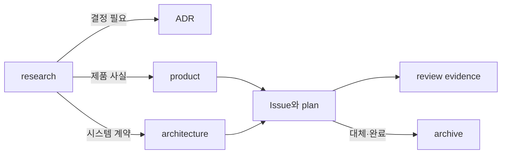

# 자주 사용하는 `docs/` 구조

실제 프로젝트마다 이름은 다르지만 반복적으로 사용한 구조를 목적과 정보 수명에 따라 정리하면 다음과 같다.

```text
docs/
├── README.md
├── product/
├── architecture/
├── adr/
├── agents/
├── plans/
├── research/
├── reviews/
├── operations/
└── archive/
```

처음부터 모든 폴더를 만들지 않는다. 문서가 실제로 필요할 때 생성한다.

## `docs/README.md`: 문서 지도

- 각 폴더의 목적
- 현재 권위 문서
- 권위가 충돌할 때 판단할 질문
- 폐기되거나 보관된 문서의 위치

새 에이전트가 문서 전체를 읽지 않고 필요한 권위를 찾게 한다.

## `product/`: 사용자와 제품 약속

담는 것:

- 대상 사용자와 문제
- 핵심 사용자 여정
- MVP 범위와 비목표
- 사용자에게 관찰되는 동작

담지 않는 것: 구현 순서, sprint 일정, 임시 migration 절차.

수명: 제품 방향이 바뀔 때까지 장기 권위.

## `architecture/`: 시스템 경계와 계약

담는 것:

- 모듈 책임과 의존 방향
- 데이터 흐름과 런타임 순서
- 외부 시스템 경계
- API, schema, file protocol 같은 계약

담지 않는 것: 아직 합의되지 않은 탐색 기록과 특정 Issue의 작업 체크리스트.

수명: 구조가 바뀔 때 갱신되는 장기 권위.

## `adr/`: 되돌리기 어려운 결정

ADR은 다음 세 조건이 모두 있을 때 만든다.

- 실제 대안이 있었다.
- 선택에 trade-off가 있다.
- 나중에 맥락 없이는 결정이 이상해 보일 수 있다.

상태, 맥락, 결정, 결과, 재검토 조건을 기록한다. 일상적인 구현 선택을 모두 ADR로 만들지 않는다.

## `agents/`: 에이전트가 사용하는 프로젝트 어댑터

프로젝트에 따라 다음을 둔다.

- domain/glossary 위치
- Issue tracker와 label 규칙
- scope-control 규칙
- 에이전트가 찾기 어려운 workflow 색인

공통 행동 규칙은 루트 `AGENTS.md`에 두고 이 폴더는 상세 참조로 사용한다.

## `plans/`: 구현 순서와 임시 작업 계획

담는 것:

- milestone과 phase
- dependency와 delivery 순서
- migration 계획
- 아직 구현되지 않은 작업의 acceptance mapping

계획은 제품의 영구적인 동작을 정의하지 않는다. 완료되거나 대체되면 archive로 이동하거나 완료 상태를 명확히 표시한다.

## `research/`: 조사와 불확실성

- 질문과 조사 범위
- 신뢰할 수 있는 출처
- 확인한 사실과 추론
- 대안과 열린 질문
- 조사 시점

조사 결과가 결정되면 필요한 내용만 product, architecture, ADR로 승격한다. research 문서 전체가 자동으로 권위가 되지는 않는다.

## `reviews/`: 독립 검토 결과

- 검토 대상과 고정된 revision
- 사용한 spec과 기준
- severity-ranked findings
- verdict와 재리뷰 결과

현재 제품 설계를 대신하지 않는다. finding이 해결되면 코드·설계·ADR이 권위를 갖고 review는 증거로 남는다.

## `operations/`: 실행과 복구

- 로컬 실행과 health check
- 배포와 rollback
- migration runbook
- 장애 진단과 credential 취급

실제로 실행 가능한 명령과 성공·실패 조건을 둔다. 비밀값 자체는 기록하지 않는다.

## `archive/`: 역사 자료

- 대체된 roadmap
- 더 이상 적용되지 않는 설계
- 완료된 임시 계획

보관 이유와 대체 문서를 표시한다. archive 문서가 현재 권위로 검색되지 않게 문서 지도에서 분리한다.

## 문서 승격 흐름



## 작은 프로젝트의 최소 구조

```text
docs/
├── README.md
├── product.md
├── architecture.md
└── adr/
```

Issue와 PR만으로 충분한 계획·리뷰 문서를 중복 생성하지 않는다. 복사 가능한 전체 예시는 [examples/project-operating-system/docs](../../examples/project-operating-system/docs/README.md)에 있다.
