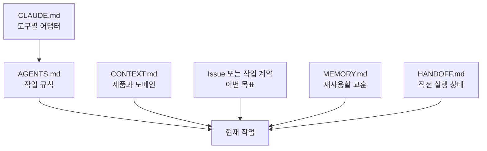

# 공통 운영 파일 설계

LLM 에이전트가 대화 기록에만 의존하면 세션이 바뀔 때 판단 기준도 바뀐다. 운영 파일은 에이전트의 기억을 무한히 늘리는 장치가 아니라, **서로 다른 종류의 정보를 올바른 수명으로 관리하는 장치**다.

## 권장 정보 구조

이 정보들은 하나의 총순위로 덮어쓸 수 없다. 서로 다른 질문에 답한다.

| 질문 | 권위 |
|---|---|
| 지금 무엇을 요청했는가? | 사용자의 현재 요청 |
| 에이전트는 어떻게 작업해야 하는가? | 적용 범위의 `AGENTS.md`와 도구 어댑터 |
| 제품은 무엇을 보장해야 하는가? | 제품 설계, 아키텍처, ADR |
| 이번 배달 범위는 무엇인가? | 현재 Issue와 acceptance criteria |
| 지금 실제 상태는 무엇인가? | Git, 런타임, 테스트, PR, CI의 live evidence |
| 과거에서 어떤 교훈을 재사용하는가? | `MEMORY.md` |
| 직전 실행은 어디까지 왔는가? | `HANDOFF.md` |

같은 질문 안에서 충돌하면 사용자의 더 최신이고 구체적인 지시와 더 좁은 범위의 저장소 규칙을 우선한다. 서로 다른 질문의 권위를 섞지 않는다. 예를 들어 Issue는 배달 범위를 정하지만 live Git 상태를 덮어쓰지 않는다. Handoff와 memory는 탐색 경로를 알려주지만 현재 상태를 증명하지 않는다.

## `AGENTS.md`: 작업 규칙

여러 에이전트가 공통으로 지켜야 할 최소 규칙을 둔다.

좋은 내용:

- 변경 전에 확인할 현재 상태
- 권위 있는 요구사항과 문서 위치
- 수정 가능 영역과 모듈 경계
- 테스트 및 검증 규칙
- 사용자 변경과 비밀정보 보호
- 로컬 commit과 push, PR, merge 같은 원격 변경의 서로 다른 승인 경계

피할 내용:

- 오래된 완료 기록
- 특정 세션의 다음 작업
- 긴 제품 설명 전체
- 도구 하나에서만 의미가 있는 명령
- 서로 충돌하는 세부 지침의 무한 누적

루트 파일은 프로젝트 전체 규칙을, 하위 `AGENTS.md`는 해당 디렉터리의 추가 규칙만 담는다.

## `CLAUDE.md`: Claude 어댑터

공통 정책은 `AGENTS.md`를 단일 원천으로 유지한다. `CLAUDE.md`에는 Claude Code가 프로젝트에 진입할 때 필요한 최소 안내와 Claude 전용 도구 사용법만 둔다.

예:

- 먼저 루트 `AGENTS.md`를 읽을 것
- 하위 디렉터리 규칙의 상속 방식
- 프로젝트에서 승인한 Claude skill 또는 command
- Claude 고유 hook이나 subagent 사용 제한

같은 규칙을 두 파일에 복제하면 시간이 지나며 서로 달라진다. 가능하면 참조하거나 짧은 어댑터로 유지한다.

## `CONTEXT.md`: 제품과 도메인

에이전트가 코드를 읽기 전에 알아야 하는 제품적 사실을 담는다.

- 어떤 사용자의 어떤 문제를 해결하는가
- 핵심 사용자 여정
- 제품 비목표
- 도메인 용어와 불변 조건
- 아키텍처 경계
- 권위 있는 설계 문서와 ADR

구현 순서나 이번 주 일정은 별도 계획과 Issue로 관리한다. 제품 설계와 delivery roadmap을 섞지 않는다.

## `MEMORY.md`: 검증된 장기 교훈

Memory에는 다음 세션에서도 반복 사용 가치가 있는 정보만 승격한다.

- 반복해서 확인된 사용자 선호
- 다시 발생할 가능성이 있는 실패와 해결법
- 오래 유지되는 설계 결정
- 검증 명령과 환경의 주의점

다음은 기록하지 않는다.

- 토큰, 비밀번호, 개인 데이터
- 원문 대화 전체
- 이미 Git과 Issue에서 쉽게 찾을 수 있는 정보
- 현재 branch, 열린 PR처럼 빠르게 변하는 사실
- 검증되지 않은 추측

각 항목에는 가능하면 근거, 확인 시점, 다시 검증해야 할 조건을 붙인다.

## `HANDOFF.md`: 현재 실행 상태

Handoff는 다른 에이전트가 5분 안에 작업을 재개하도록 돕는다.

- 목표와 현재 작업 단위
- repository, branch, HEAD
- 완료된 것과 아직 남은 것
- 실행한 테스트와 결과
- 보호해야 할 사용자 변경
- 차단 요소와 필요한 결정
- 가장 작은 다음 단계

작업을 재개하는 에이전트는 Handoff를 그대로 믿지 않고 Git, 테스트, PR, CI, Issue 상태를 다시 확인한다.

## 유지관리 규칙

- 하나의 사실은 가능한 한 하나의 권위 파일에만 둔다.
- 파일이 길어지면 더 많은 규칙을 추가하기 전에 오래된 규칙을 삭제한다.
- 현재 상태와 영구 정책을 분리한다.
- 도구 전용 파일이 공통 정책을 재정의하지 않게 한다.
- 중요한 규칙에는 그것이 막는 실제 실패 유형을 함께 적는다.
- 자동 생성된 메모리는 사람이 신뢰할 수 있는 상태로 정제한 뒤 사용한다.
