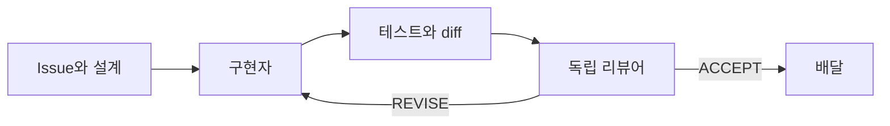

# 공유하기 좋은 LLM 에이전트 하네스 패턴

여기서 하네스는 모델을 감싸는 작업 구조다. 입력, 역할, 도구, 상태, 검증, 종료 조건을 정의한다. 가장 복잡한 구조가 가장 좋은 것은 아니다. **실패 비용을 감당할 수 있는 가장 작은 하네스**를 고른다.

## 선택표

| 패턴 | 에이전트 수 | 적합한 작업 | 핵심 증거 |
|---|---:|---|---|
| 1. 단일 에이전트 | 1 | 질문, 탐색, 작은 수정 | 답변 또는 focused test |
| 2. 계획–실행–검증 | 1 | 명확한 기능과 버그 | 계획, diff, test |
| 3. 구현–독립 리뷰 | 2 | 중요한 코드와 문서 | diff, review verdict |
| 4. Worktree DAG | 3+ | 독립적인 여러 이슈 | lane별 test와 merge gate |
| 5. 블랙박스 사용자 | 2+ | UI, API, 사용자 여정 | 관찰 가능한 outcome |
| 6. 다중 관점 결정 | 3+ | 제품·설계의 큰 결정 | 근거 있는 decision record |
| 7. CI·증거 하네스 | 가변 | 반복 배달과 자동 운영 | immutable evidence와 receipt |
| 8. Operator orchestrator | 가변 | 사람이 routing을 지속하기 어려운 장기·다중 작업 | state, decision request, receipt |

## 1. 단일 에이전트

```text
사용자 → 에이전트 → 결과
```

다음 조건이면 충분하다.

- 변경이 작고 되돌리기 쉽다.
- 요구사항이 명확하다.
- 한 번의 focused test로 결과를 확인할 수 있다.
- 역할 분리 비용이 실패 비용보다 크다.

종료 조건: 요청한 결과와 최소 검증이 제공되었다.

## 2. 계획–실행–검증 하네스

```text
상태 확인 → 짧은 계획 → 구현 → 검증 → 보고
```

계획은 긴 문서가 아니라 작업 범위와 검증 방법에 대한 합의다. 구현 중 새로운 사실이 발견되면 계획을 갱신한다.

필수 계약:

- 목표와 비목표
- 허용 경로
- acceptance criteria
- 실행할 검증
- 외부 변경 승인 범위

종료 조건: criteria별 증거가 있고 working tree의 남은 변경을 설명할 수 있다.

## 3. 구현자–독립 리뷰어 하네스



리뷰어에게 구현자의 자기설명보다 요구사항과 실제 diff를 우선 제공한다. 리뷰 범위는 명확히 제한한다.

좋은 리뷰 finding은 다음을 포함한다.

- 정확한 위치
- 실패하는 요구사항 또는 불변 조건
- 사용자나 시스템에 미치는 영향
- 최소 수정 방향

종료 조건: 구체적인 미해결 finding이 없고 독립 판정이 `ACCEPT`다.

## 4. Worktree DAG 하네스

여러 작업을 의존성 그래프로 나누고, 서로 충돌하지 않는 lane만 격리 worktree에서 병렬 실행한다.

```text
Baseline
 ├─ Lane A: 구현 → 리뷰 ─┐
 ├─ Lane B: 구현 → 리뷰 ─┼→ 순차 merge → 공유 smoke
 └─ Lane C: A 이후 실행 ─┘
```

각 lane은 다음을 소유한다.

- 하나의 명확한 Issue
- 허용 파일 범위
- 자체 테스트와 증거
- 별도의 리뷰 결과
- branch와 worktree identity

merge할 때는 앞선 변경이 반영된 최신 main으로 rebase하고, 공유 파일의 두 계약이 모두 살아 있는지 다시 검증한다.

종료 조건: 모든 lane의 개별 gate와 최종 통합 gate가 통과했다.

## 5. 블랙박스 사용자 하네스

구현 세부사항을 모르는 사용자 역할이 실제 노출된 인터페이스만 사용한다.

나쁜 미션:

```text
POST /api/items를 호출하고 DB row가 생겼는지 확인한다.
```

좋은 미션:

```text
처음 방문한 운영자로서 새 요청을 등록하고,
처리 담당자가 그것을 발견해 다음 행동을 결정할 수 있는지 확인한다.
```

UI는 실제 서버와 브라우저에서 확인한다. 위험한 중복 생성, 결제, 삭제 같은 행동은 예방 장치가 검증되지 않았다면 실행 직전에 멈춘다.

종료 조건: 사용자 역할별 관찰 가능한 outcome과 실패 지점이 기록되었다.

## 6. 다중 관점 의사결정 하네스

중요한 제품 또는 설계 결정에 서로 다른 관점을 배정한다.

- 제품 관점: 실제 사용자 가치를 살리는가
- 아키텍처 관점: 장기적인 경계와 불변 조건을 지키는가
- 운영 관점: 구현·검증·유지가 가능한가
- 회의적 리뷰어: 전제와 숨은 범위 확장을 공격한다

의견을 단순 투표로 합치지 않는다. 각 주장을 같은 권위 문서와 증거에 대조한 뒤 결정권자가 `ACCEPT / REVISE / REJECT`를 내린다.

종료 조건: 결정, 근거, 기각한 대안, 재검토 조건이 ADR이나 decision record에 남았다.

## 7. CI·증거 기반 하네스

반복 실행되는 에이전트 작업에서는 채팅 메시지가 아니라 구조화된 artifact를 전달한다.

```text
Task packet
  → Attempt
  → Result artifact
  → Independent verification
  → Receipt
  → Promotion 또는 replan
```

유용한 artifact 예:

- 작업 계약과 입력 버전
- 변경 diff 또는 content identity
- 실행한 테스트와 환경 정보
- 리뷰 verdict와 finding
- 최종 적용 여부와 실패 이유

검증 직전과 결과 공개 직전에 코드와 artifact의 identity가 변하지 않았는지 확인한다. 비밀값은 artifact나 로그에 넣지 않는다.

종료 조건: 결과가 검증 가능한 provenance와 terminal receipt를 가진다.

이 수준의 ceremony는 같은 작업을 여러 번 자동 실행하거나 잘못된 결과 공개 비용이 큰 경우에만 사용한다. 최소 JSON 예시와 실제 흐름은 [end-to-end 예시](example-end-to-end.md)에 있다.

## 흔한 실패

- 작은 작업에도 에이전트를 과도하게 늘린다.
- 병렬 작업이 같은 파일을 수정하는지 확인하지 않는다.
- 구현자가 자신의 결과를 최종 승인한다.
- 리뷰어가 요구사항 대신 취향을 검토한다.
- Handoff의 과거 상태를 현재 사실처럼 사용한다.
- 테스트 통과를 사용자 outcome 통과로 착각한다.
- merge 후 공유 검증을 다시 실행하지 않는다.
- 상태와 증거를 채팅 안에만 남긴다.

## 8. Operator orchestrator

사람이 매 단계의 agent, phase, prompt, 재시도를 선택하지 않아도 한 요청을 terminal outcome까지 운영한다.

```text
human request
  → request contract
  → context/workflow/skill selection
  → admitted task graph
  → worker artifacts
  → independent verification
  → repair | replan | material decision | typed block | receipt
```

필요한 조건:

- durable run state와 artifact
- Task와 runtime Attempt의 구분
- worker와 verifier identity 분리
- dependency와 write conflict를 아는 scheduler
- routine choice와 Material Decision의 구분
- retry budget, cancellation reconciliation, typed block
- agent의 성공 선언이 아닌 receipt 기반 completion

이 구조는 여러 agent를 부르는 것보다 상태·권위·종료 semantics가 중요하다. 구체적인 역할과 도입 단계는 [orchestrator as operator](orchestrator-as-operator.md)를 따른다.
