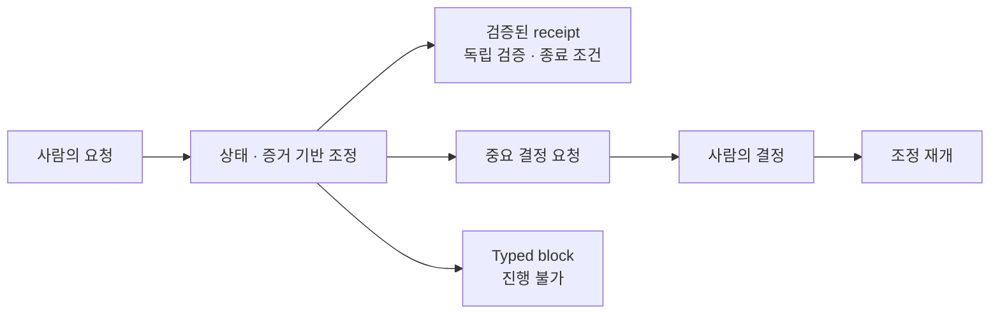

# 오케스트레이터가 사람의 operator 역할을 대신하는 방식

이 문서는 내가 지향하는 orchestration 모델을 입문자도 적용할 수 있도록 단계적으로 설명한다. 상세 개념은 [`opencode-orchestrated-agent-workflow` 설계 snapshot `7d0190b`](https://github.com/hjung3113/opencode-orchestrated-agent-workflow/tree/7d0190be88549a39af6c3bfe53b812adeb4a1b1e/docs/design)에서 일반화했다.

## 문제: 사람이 orchestration glue가 된다

단순 multi-agent workflow에서는 사람이 계속 다음 일을 한다.

- 요청을 task로 나눈다.
- 어떤 agent와 model을 쓸지 고른다.
- 이전 agent의 결과를 다음 prompt에 복사한다.
- worker가 끝났는지 확인한다.
- review finding을 다시 구현자에게 전달한다.
- 실패할 때 재시도와 중단을 결정한다.
- 무엇이 진짜 완료 상태인지 기억한다.

이 방식은 agent 수가 늘수록 사람의 coordination 비용과 누락 가능성을 키운다.

## 목표: 한 요청에서 검증된 outcome까지

외부 interface는 깊고 작아야 한다.



사람은 agent 이름, phase 순서, task manifest, context 전달 방식을 직접 지정하지 않아도 된다. 오케스트레이터가 현재 state와 evidence를 기준으로 선택한다.

## 오케스트레이터가 소유하는 책임

### 1. Intake

자연어 요청을 다음을 포함하는 request contract로 바꾼다.

- objective
- scope와 exclusions
- ambiguity와 recorded assumption
- target과 현재 snapshot
- 성공·실패 조건

의도를 새로 만들지 않는다. 이미 요청과 repository policy로 정해진 낮은 위험의 선택은 assumption으로 기록하고 진행한다.

### 2. Context compilation

다음 task에 필요한 정보만 선택한다.

- 승인된 결정
- 관련 제품·아키텍처 계약
- 현재 Issue와 acceptance criteria
- 필요한 evidence와 failure history
- 보호할 dirty/untracked state

대화 전체를 전달하는 대신 출처가 있는 file-backed context를 만든다.

### 3. Workflow, skill, model selection

현재 불확실성을 가장 작게 줄이거나 receipt에 가까워지게 하는 workflow를 고른다.

| 현재 필요 | 선택 예 |
|---|---|
| 요청이 모호함 | intake 또는 specification |
| 외부 사실이 필요함 | bounded research |
| 되돌리기 어려운 구조 | design과 decision review |
| 명확한 local change | implementation |
| 결과가 생성됨 | independent verification |
| 구체적 finding | focused repair |

skill과 model은 workflow packet의 명시적 입력이다. 개발자 환경에 우연히 설치된 암묵적 상태로 두지 않는다.

### 4. Task graph compilation

Task를 작은 실행 계약으로 만든다.

- immutable packet
- dependency
- declared read/write resources
- acceptance criteria
- capability와 deadline
- required artifact
- escalation condition

서로 겹치는 write는 직렬화하고 독립적인 task만 병렬 실행한다. graph는 처음 만든 계획에 고정되지 않고 새 evidence와 finding에 따라 새 revision으로 바뀐다.

### 5. Dispatch와 runtime observation

각 Task Attempt는 fresh runtime identity와 격리 workspace를 가진다. runtime이 idle하거나 exit code가 0이라는 사실은 완료 verdict가 아니다.

오케스트레이터는 다음을 확인한다.

- 실제 workspace diff
- output snapshot identity
- 허용 범위 위반
- 필요한 terminal artifact
- runtime failure, deadline, cancellation 상태

### 6. Independent verification

worker의 reasoning을 그대로 review context로 사용하지 않는다. verifier는 contract, exact output snapshot, diff, evidence를 독립적으로 받는다.

- pass → 현재 snapshot의 completion gate 후보
- finding → 하나의 focused repair task
- block → 필요한 evidence나 authority를 명시

검증 이후 output이 바뀌면 verdict는 무효다.

### 7. Replan과 focused repair

finding을 원래 artifact에서 지우지 않는다. immutable finding을 참조하는 successor repair와 review를 만든다. 새 evidence가 dependency를 바꾸면 graph revision을 새로 만든다.

같은 원인의 실패를 무한 재시도하지 않는다. budget과 escalation 조건에 따라 typed block으로 종료한다.

### 8. Receipt, status, resume, cancel

완료는 agent의 “done” 메시지가 아니라 receipt다. receipt는 다음을 연결한다.

- accepted request와 material decision
- graph와 task
- 사용한 workflow와 skill
- result와 exact snapshot
- evidence와 independent verification
- 알려진 limitation
- 실제 적용 또는 보존된 위치

resume은 private chat history를 추측하지 않고 durable state와 immutable artifact에서 다음 행동을 재구성한다. cancel은 signal을 보냈다는 사실과 runtime이 실제 중단됐다는 사실을 구분한다.

## 사람에게 남기는 권한

오케스트레이터가 사람을 자주 묻는 approval gate로 만들면 operator 역할을 대신하지 못한다. 다음에만 focused Material Decision을 요청한다.

- objective, scope, exclusion이 달라진다.
- 사용자에게 보이는 contract가 달라진다.
- 오래 유지되는 cross-cutting structure나 운영 dependency가 달라진다.
- 되돌리기 어려운 외부 효과의 authority가 필요하다.

다음은 보통 material decision이 아니다.

- formatting과 naming 같은 local reversible choice
- 이미 acceptance criteria가 정한 구현 세부사항
- routine retry와 workflow transition
- model confidence가 낮다는 사실 자체

## 권위는 분리한다

모델은 판단을 제안하지만 스스로 권한을 만들지 않는다.

| 권위 | 의미 | 보유자/집행자 |
|---|---|---|
| Decision Authority | 목적과 material direction 결정 | 사람 또는 이미 승인된 policy |
| Execution Authority | 한 Task가 수행할 수 있는 행동 | 요청·policy·packet·runtime capability의 교집합 |
| Result Finalization Authority | 내부 authoritative run state와 artifact 확정 | 검증 규칙을 집행하는 coordinator/kernel |

하위 layer는 authority를 좁히거나 확장을 요청할 수 있지만 조용히 넓힐 수 없다.

## 입문 단계에서 구현하는 방법

### Level 1: 사람이 coordinator

사람이 task를 선택하되 `HANDOFF.md`와 review contract를 사용한다.

### Level 2: 파일 기반 coordinator

coordinator agent가 task list, status, finding, next action을 파일에 기록하고 사람은 material decision만 한다.

### Level 3: supervised orchestrator

오케스트레이터가 workflow와 task graph를 선택하고 worker/reviewer를 dispatch한다. 사람은 status를 보고 외부 publication을 승인한다.

### Level 4: deterministic admission

schema, capability, state transition, actor separation, snapshot identity, 내부 result 확정을 deterministic kernel이 검사한다. 모델은 proposal만 만든다.

각 Level은 앞 단계의 실패 비용과 반복량이 다음 단계의 구축 비용을 정당화할 때만 올라간다.

## Coordinator loop 예시

```text
while run is active:
  load canonical state and new artifacts
  reconcile runtime observations
  derive ready, completed, stale, and blocked work
  if material decision is required:
    publish one focused question and pause
  else if current snapshot has independent pass and all exits hold:
    publish receipt
  else if a finding exists:
    admit one focused repair
  else if no useful action can proceed:
    publish typed block
  else:
    compile and dispatch the smallest useful task set
```

## 안티패턴

- caller에게 agent와 phase를 직접 고르게 한다.
- worker의 self-report를 verification으로 사용한다.
- graph나 prompt를 만들었다는 이유로 완료 처리한다.
- private chat history를 유일한 workflow state로 사용한다.
- 모든 ambiguity를 사람에게 묻는다.
- runtime exit를 Task completion으로 해석한다.
- review 이후 바뀐 snapshot을 이전 verdict로 publish한다.
- 같은 실패를 budget 없이 재시도한다.
- verified result와 실제 사용자 branch/PR/deploy에 적용된 결과를 혼동한다.

## 최소 도입 체크리스트

- [ ] 한 요청의 terminal outcome을 정의했다.
- [ ] coordinator가 next action을 state에서 선택한다.
- [ ] worker와 verifier가 분리되어 있다.
- [ ] task, attempt, artifact, finding을 구분한다.
- [ ] 사람에게 묻는 materiality 기준이 있다.
- [ ] retry, cancellation, block의 종료 semantics가 있다.
- [ ] completion receipt가 exact output과 evidence를 가리킨다.
- [ ] external application은 별도 authority를 요구한다.
